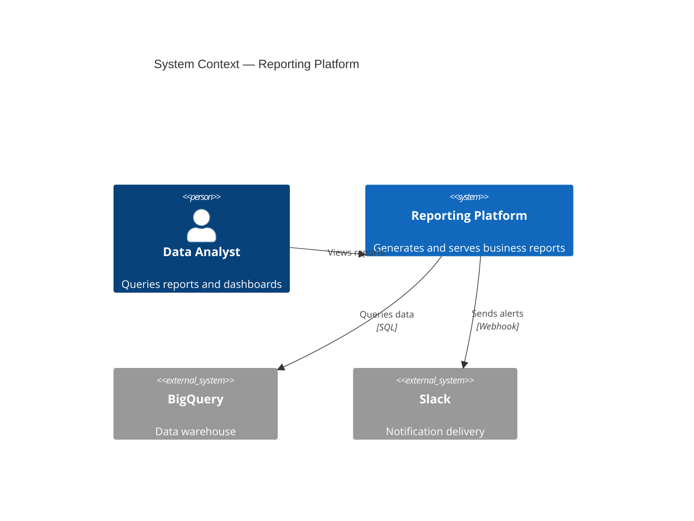
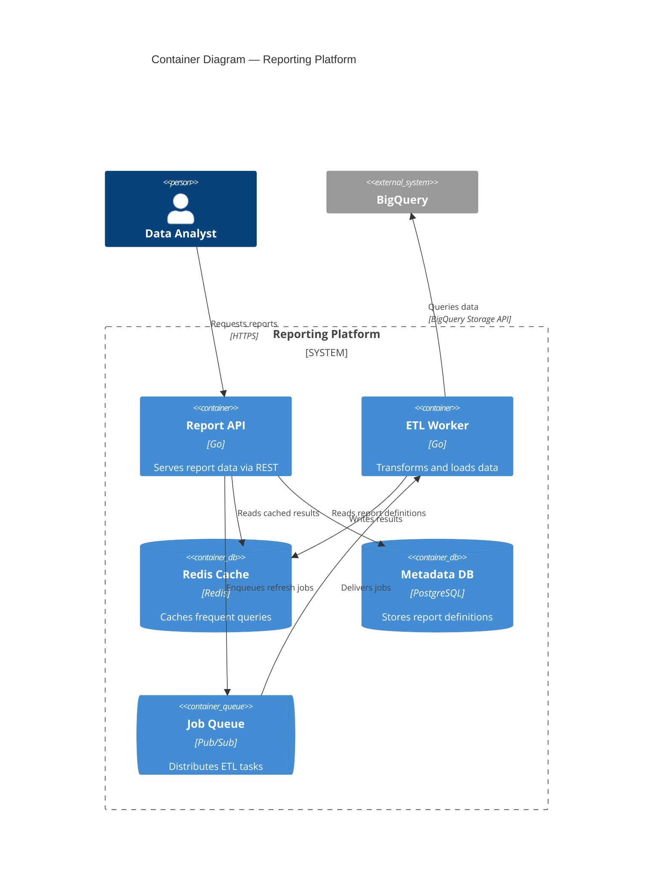
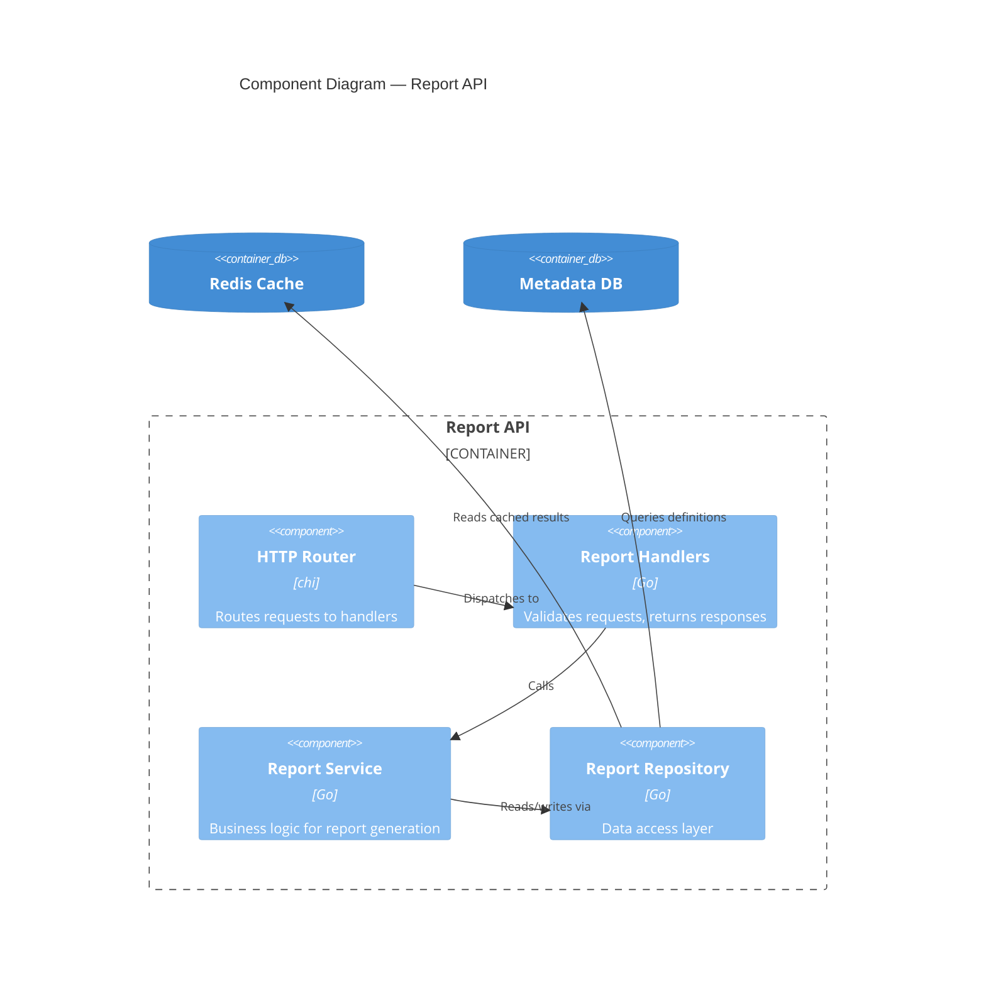
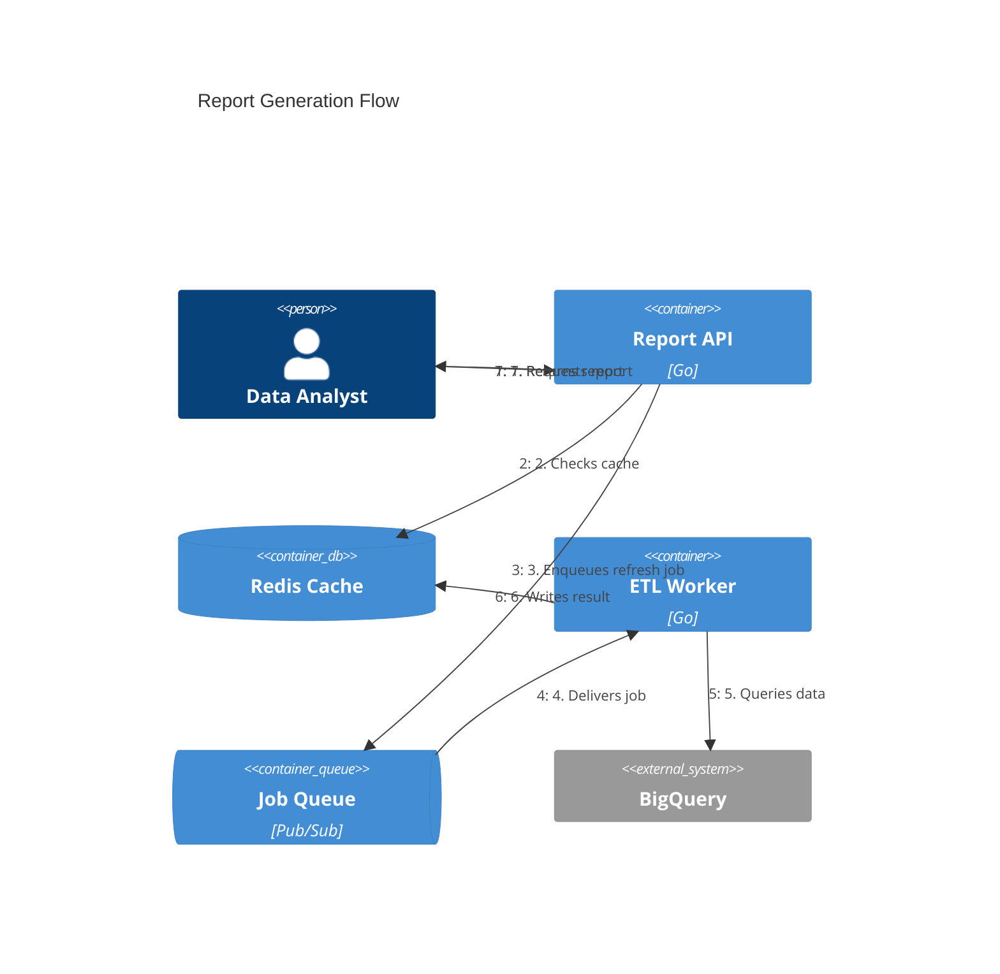
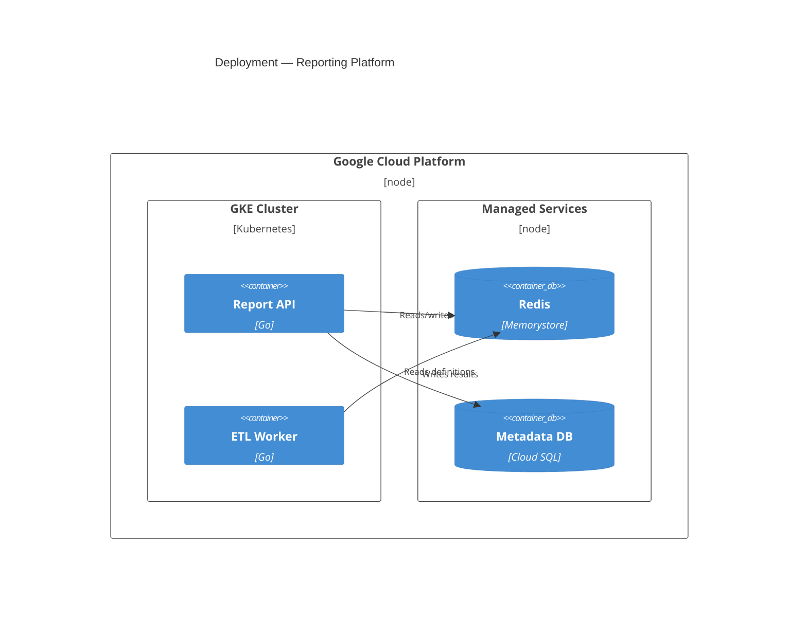

# C4 Model — Mermaid Reference

The C4 model gives you four zoom levels for architecture diagrams, plus Dynamic and Deployment diagram types.

## The Four Levels

### Level 1 — System Context (C4Context)

The highest zoom level. Your system as a single box, surrounded by users and external systems. Every stakeholder should understand this diagram.

**Use when:** introducing the system, README overviews, showing how the system fits into the landscape.

### Level 2 — Container Diagram (C4Container)

Zoom into your system. Shows deployable units — services, apps, databases, queues. Each container is separately runnable/deployable.

**Use when:** showing internal architecture, explaining service communication, onboarding engineers.

### Level 3 — Component Diagram (C4Component)

Zoom into a single container. Shows major structural blocks inside — packages, modules, key interfaces.

**Use when:** explaining internals of a specific service, documenting a complex module.

### Level 4 — Code

Class-level diagrams. Usually auto-generated. Rarely worth writing by hand. Only create for particularly complex or non-obvious internal structures. Use standard Mermaid `classDiagram` syntax if needed.

## Additional Diagram Types

### Dynamic Diagram (C4Dynamic)

Shows the flow of a specific request or operation, numbered and sequenced. Use instead of sequence diagrams when you want flow overlaid on architecture.

### Deployment Diagram (C4Deployment)

Shows how containers map to infrastructure. Servers, clusters, cloud regions.

## Syntax Reference

### Elements

| Element | Syntax | Use for |
|---|---|---|
| Person | `Person(alias, "Label", "Description")` | Users, actors |
| External person | `Person_Ext(alias, "Label", "Description")` | Users outside your org |
| System | `System(alias, "Label", "Description")` | Your system (Level 1) |
| External system | `System_Ext(alias, "Label", "Description")` | Systems you don't control |
| Container | `Container(alias, "Label", "Tech", "Description")` | Deployable units |
| Container (DB) | `ContainerDb(alias, "Label", "Tech", "Description")` | Databases |
| Container (Queue) | `ContainerQueue(alias, "Label", "Tech", "Description")` | Message queues |
| Component | `Component(alias, "Label", "Tech", "Description")` | Modules inside a container |

### Boundaries

| Boundary | Syntax | Use for |
|---|---|---|
| System | `System_Boundary(alias, "Label") { ... }` | Group containers in a system |
| Container | `Container_Boundary(alias, "Label") { ... }` | Group components in a container |
| Enterprise | `Enterprise_Boundary(alias, "Label") { ... }` | Group systems in an org |
| Deployment node | `Deployment_Node(alias, "Label", "Tech") { ... }` | Infrastructure grouping |

### Relationships

| Relationship | Syntax |
|---|---|
| Basic | `Rel(from, to, "Label")` |
| With technology | `Rel(from, to, "Label", "Technology")` |
| Bidirectional | `BiRel(from, to, "Label")` |

## Guidelines

- **Always start at Level 1.** Even if the user wants component details, provide context first.
- **One diagram per zoom level.** Don't mix levels. Container diagrams should not contain component detail.
- **Label every relationship.** Include the verb ("Sends", "Queries") and protocol where relevant ("HTTPS", "gRPC").
- **Use `_Ext` suffixes** for anything outside your control.
- **Keep it focused.** More than ~15 elements? Split the diagram.
- **Introduce every diagram** with a sentence explaining what it shows. Follow with the key insight.
